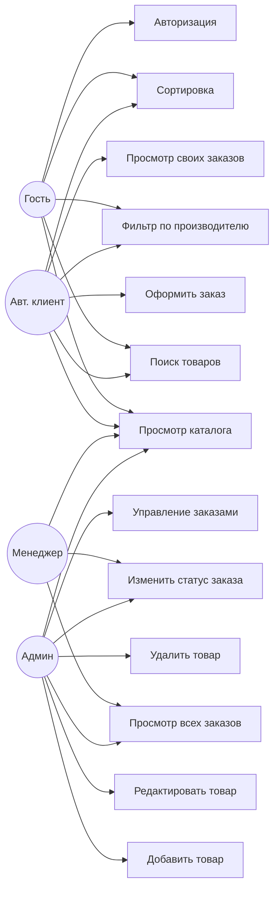

# UML Use-Case диаграмма

**Система:** Магазин строительных материалов (Demoekzamen)

## Акторы

- **Гость** — неавторизованный посетитель
- **Авторизированный клиент** — зарегистрированный покупатель
- **Менеджер** — сотрудник, обрабатывающий заказы
- **Администратор** — полный доступ ко всей системе

## Диаграмма (Mermaid)

## Описание прецедентов

| ID | Прецедент | Акторы | Описание |
|---|---|---|---|
| UC1 | Просмотр каталога | Все | Открытие листинга товаров с фото и ценами |
| UC2 | Поиск | Все | Realtime поиск по названию/описанию |
| UC3 | Фильтр по производителю | Все | Выбор из выпадающего списка |
| UC4 | Сортировка | Все | По цене ↑/↓, по названию |
| UC5 | Авторизация | Гость | Вход в систему по логину/паролю |
| UC6 | Оформить заказ | Клиент | Создание заказа с выбором точки выдачи |
| UC7 | Просмотр своих заказов | Клиент | Список с фильтрацией по статусу |
| UC8 | Просмотр всех заказов | Менеджер, Админ | Все заказы всех клиентов |
| UC9 | Изменить статус заказа | Менеджер, Админ | new → processing → shipped → delivered → completed |
| UC10 | Добавить товар | Админ | ID авто+1, все поля из схемы Products |
| UC11 | Редактировать товар | Админ | Article read-only, остальные поля редактируемые |
| UC12 | Удалить товар | Админ | С подтверждением. Запрет при наличии в заказах |
| UC13 | Управление заказами | Админ | Полный CRUD по заказам |

## Правила доступа

- Гость — только просмотр и поиск каталога.
- Клиент — всё как у гостя + собственные заказы.
- Менеджер — просмотр/изменение статусов всех заказов, не может редактировать товары.
- Админ — полный доступ ко всем сущностям.
